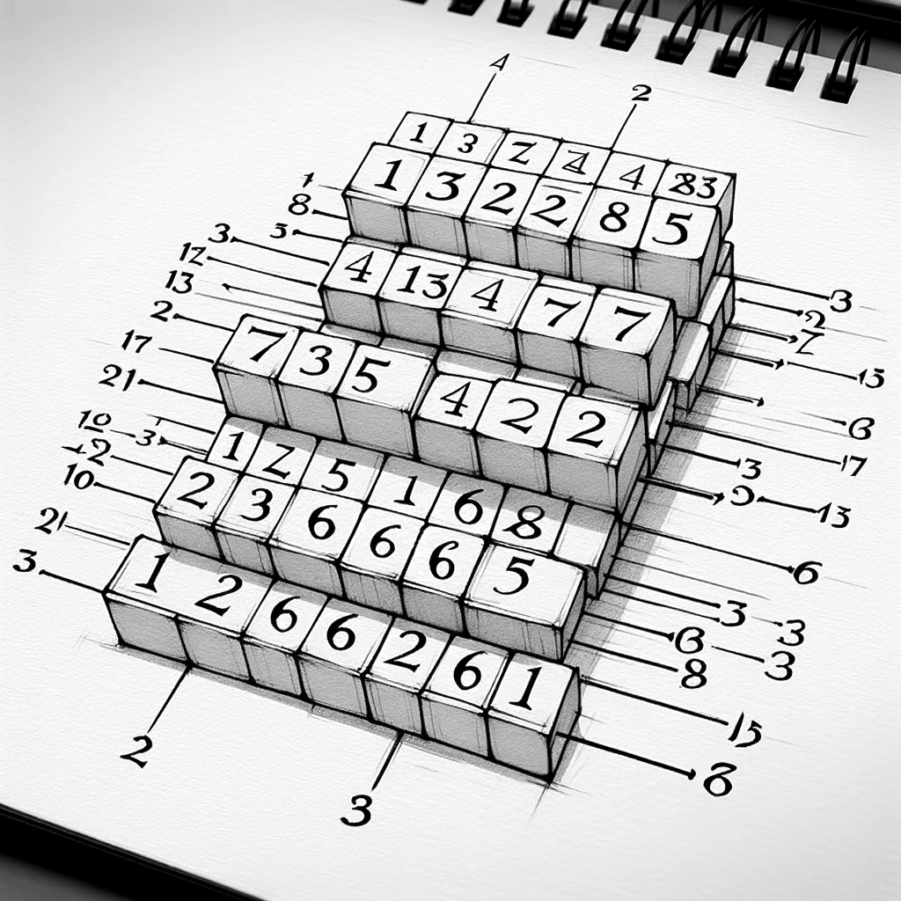

# Secuencias Mágicas



> **Nota** Recuerde descomprimir la prueba antes de comenzar a trabajar. Si programa dentro del comprimido es posible que pierda su solución sin posibilidad de reclamar. 

Una secuencia se define como mágica si esta formada por una serie de bloques, cada uno comenzando con su tamaño seguido por sus elementos. Por ejemplo:
1. La secuencia [3, 3, 4, 5, 2, 6, 1] es mágica pues está formada por dos bloques [`3, 3, 4, 5`, `2, 6 , 1`] señalado. 
2. [`1, 8`, `4, 5, 2, 6, 1`] es mágica.
3. [1] no es mágica, pero [], la secuencia vacía, sí lo es.
4. [1, 4, 3] ni [3, 2, 1] son mágicas.

Definimos una operación sobre una secuencia como la acción de remover un elemento cualquiera. Se quiere conocer dada una secuencia `s` compuesta por enteros el menor número de operaciones que se tiene que realizar sobre esta tal que se pueda convertir en una secuencia mágica.

## Programa

Usted debe escribir la respuesta al problema en el archivo _Solution/Solution.cs_. En _Solution.cs_ se encuentra la función `CantidadMinimaEliminaciones` dentro de la cual debe escribir su lógica o cualquier llamado a esta.

```csharp
public static int CantidadMinimaEliminaciones(int[] secuencia)
```

La función recibe la secuencia a analizar representada por un arreglo de enteros de longitud mayor o igual que 0. Cada uno de los elementos del arreglo se enceuntran entre 1 y la longitud del arreglo. Se espera que el valor de retorno represente la menor cantidad de operaciones requeridas para convertir la secuencia de entrada en una secuencia mágica.

Para comprobar que su solución funciona sin problemas ejecute el siguiente comando:

```bash
dotnet run --project Main
```

> **Nota** Se recomienda siempre correr el código antes de comenzar a programar para verificar que no exista ningún tipo de problema técnico con la prueba.

## Ejemplos

Los próximos ejemplos representan secuencias y como deben quedar tras convertirlas en mágicas:

1. [`3, 3, 4, 5`, `2, 6, 1`] necesita 0 operaciones.

2. [5, 6, 3, 2] -> [ ], necesita 4 operaciones.

3. [3, 4, 1, 6, 7, 7] -> [`4 , 1, 6, 7, 7`], necesita 1 operación.

4. [1, 2, 3, 1, 2] -> [`1, 2`, `1, 2`], necesita 1 operación.

El correcto resultado de los ejemplos que se brindan con la prueba no significa que su solución sea correcta. Es buena idea añadir ejemplos suyos.
